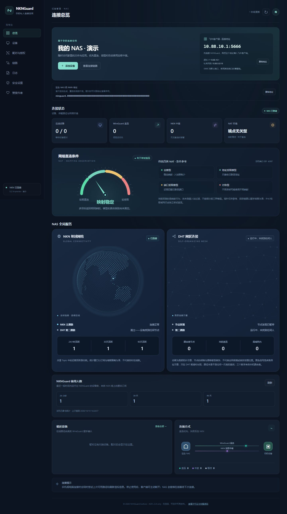
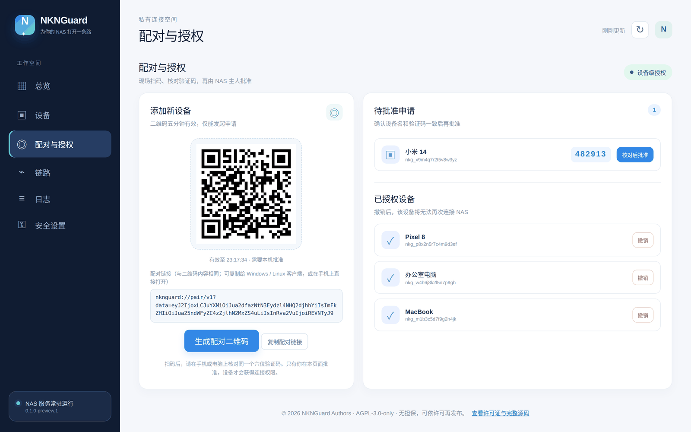
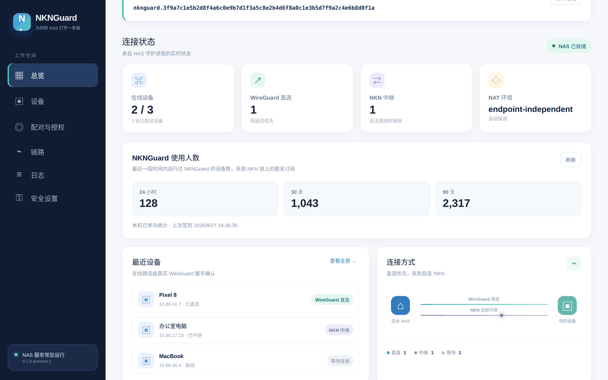
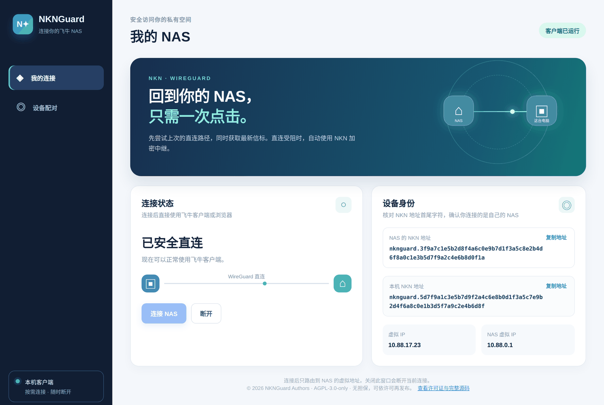
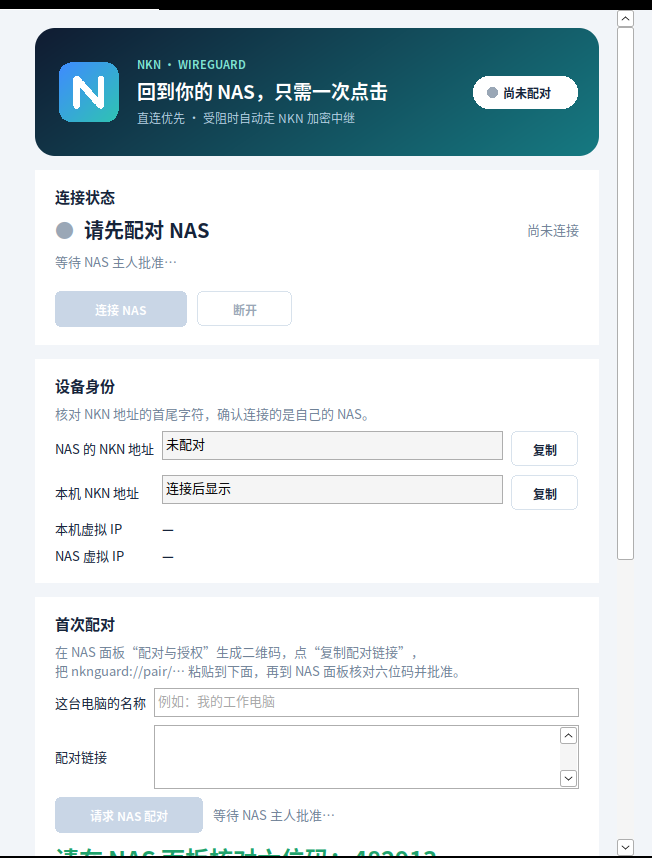
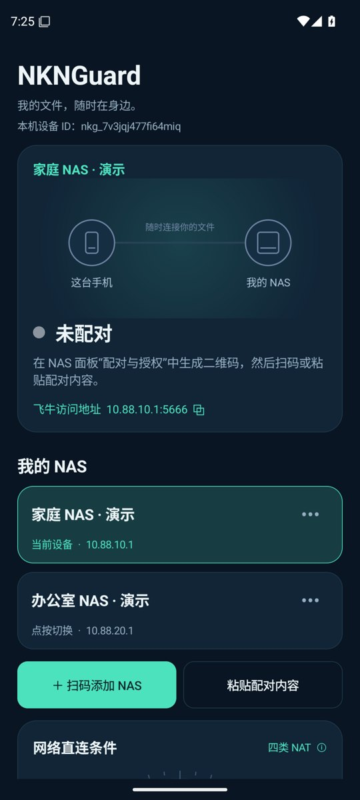

<div align="center">

# NKNGuard

**扫码授权，直连优先，随时访问自己的 NAS。**

基于 [NKN](https://nkn.org)、ICE 与 WireGuard 的 NAS 私有连接。无需部署协调服务器；直连失败时回落到 NKN 加密中继，已配对设备也能通过私有 DHT 同步连接信息。

[](https://github.com/Viper-Boss/nknguard/releases)
[](https://github.com/Viper-Boss/nknguard/actions/workflows/ci.yml)
[](https://github.com/Viper-Boss/nknguard/actions/workflows/android.yml)
[](LICENSE)


**简体中文** · [English](README.en.md) · **[❤ 赞赏作者](#-赞赏作者)**



</div>

> [!WARNING]
> **开发预览版。** 协议、NAS 端、Windows 与 Android 客户端都有自动化测试，已在局域网及部分运营商网络完成 Android 到 NAS 的真机连接测试；不同路由器、运营商和长时间运行仍需持续验证。请先在非关键设备上试用，不要把它当作唯一的远程访问手段。

## 下载

### 断线恢复与连接消息

手机主动请求连接后，NAS 才开始交换当前配置；连接阶段每 3 秒重试，最多 90 秒。短暂断网时直连和 NKN 中继共同参与恢复，任一路径恢复就结束倒计时。连续无法恢复 90 秒后清理该设备的连接，保留配对和授权，之后可点击“连接”重新尝试。

手机和 NAS 面板均显示恢复状态及倒计时。正常断开发送签名通知；通知丢失时根据收包超时进入恢复，最终自动清理。未变配置使用签名续期，连接控制消息不缓存给离线设备；首次配对消息仅保留 30 秒递送窗口。倒计时在本地更新，不增加网络消息。

安卓、Windows 安装器与便携包、飞牛 x86_64 / ARM64 FPK 都在右侧 **[Releases 发布页](https://github.com/Viper-Boss/nknguard/releases)**。按设备架构选择；使用说明见[客户端使用与验收](docs/CLIENT_ACCEPTANCE.md)。

| 平台 | 文件 | 说明 |
| --- | --- | --- |
| 🗄️ **NAS / Linux**（ARM64，飞牛 ARM 机型） | `nknguard-linux-arm64` | 需要 root 与 `wireguard-tools`，见[安装 NAS 端](#1-安装-nas-端) |
| 🗄️ **NAS / Linux**（x86_64） | `nknguard-linux-amd64` | 同上 |
| 🪟 **Windows 10/11** | `NKNGuard-Windows-x86_64-preview.zip` | 原生桌面程序，带托盘图标；需要先安装 [WireGuard for Windows](https://www.wireguard.com/install/) |
| 🤖 **Android 8.0+** | `NKNGuard-Android-preview.apk` | 维护者交付的 APK 使用持续保留的签名证书，可覆盖安装；原始 CI 包签名可能不同 |

**更新：** NAS 在“系统更新”检查版本并上传对应架构的签名更新包；Android 支持检查、下载和导入本地 APK；Windows 在“应用更新”检查并打开发布页。更新说明见[升级指南](docs/UPDATES.md)。飞牛应用中心需要可用数据卷，安装包构建不代表所有机型已完成实机验收。

每个版本都附带 `SHA256SUMS`，下载后可以核对：`sha256sum -c SHA256SUMS`。Windows 预览版尚未签名；维护者交付的 Android 包保持同一签名，原始 CI 调试包使用临时签名。

## 截图

<table>
  <tr>
    <td width="50%"><br><sub><b>NAS 面板 · 配对与授权</b>：一次性二维码和同内容的配对链接，核对六位码后批准，随时撤销单台设备</sub></td>
    <td width="50%"><br><sub><b>NAS 面板 · 总览</b>：设备连接状态，以及最近 24 小时 / 30 天 / 90 天的 NKNGuard 使用人数</sub></td>
  </tr>
  <tr>
    <td width="50%"><br><sub><b>Windows 客户端</b>：原生窗口，一键连接，关闭后缩到托盘保持连接</sub></td>
    <td width="50%"><br><sub><b>Windows 客户端 · 首次配对</b>：粘贴配对链接，在 NAS 上核对同一个六位码</sub></td>
  </tr>
</table>

<sub>截图由真实界面代码渲染（Windows 客户端截图来自 Wine），设备名、地址、人数等为演示数据。Android 截图来自实际应用的模拟器运行，NAS 资料标注为演示。</sub>


## 安卓界面



原生安卓界面，分别保存每台 NAS 的配对信息，支持命名、切换和单独删除。

## ❤ 赞赏作者

如果 NKNGuard 对你有帮助，欢迎支持项目维护。赞赏完全自愿，不影响功能或设备授权。

直接扫描下方二维码；点击图片可查看原图。

<table>
  <tr><th align="center">微信</th><th align="center">支付宝</th></tr>
  <tr>
    <td align="center"><a href="internal/app/dashboard/wechat.png"></a></td>
    <td align="center"><a href="internal/app/dashboard/alipay.png"></a></td>
  </tr>
</table>

<table>
  <tr><th align="center">USDT · TRC20（Tron）</th><th align="center">BTC · Bitcoin</th></tr>
  <tr>
    <td align="center"><a href="docs/images/support-usdt.png"></a></td>
    <td align="center"><a href="docs/images/support-btc.png"></a></td>
  </tr>
  <tr><th align="center">ETH · Ethereum<br>USDC · ERC20</th><th align="center">SOL · Solana</th></tr>
  <tr>
    <td align="center"><a href="docs/images/support-eth.png"></a></td>
    <td align="center"><a href="docs/images/support-sol.png"></a></td>
  </tr>
</table>

<details>
<summary>复制区块链收款地址</summary>

**USDT · TRC20（Tron）**

```text
TEwbANy1Mo3DFdT6CMphgjU511LzbCoQsm
```

**BTC · Bitcoin**

```text
bc1q8m5fp9jgmve8sjva2cfdwhs3pc65723nezrc3v
```

**ETH / USDC · Ethereum（USDC：ERC20）**

```text
0x9d955292BD72904fB5D5D9A147250A625f80c6E5
```

**SOL · Solana**

```text
24BL4HqrJUdDzg6fu3yk4Qi5oh6utRUWEQitpCa5HgwS
```

</details>

## 特点

- 🔐 **数据面是 WireGuard。** 所有流量都由 WireGuard 加密，NKNGuard 不碰包加密。
- 🛰️ **控制面是 NKN，没有我们的服务器。** 设备通过 NKN 网络互相发现、交换签名记录；控制消息端到端加密。
- ⚡ **直连优先，中继待命。** ICE 并行探测 IPv4 / IPv6 可用路径，再用 WireGuard 握手验证；NKN 会话保持备用，有直连时不承载用户数据，失败时接管并持续重试直连。
- 📱 **扫码配对，主人批准。** 二维码只含 NAS 公钥和一次性申请令牌，不含入网密钥。新设备必须在 NAS 面板核对六位码并批准；可以随时撤销单台设备，被撤销的手机会立即收到签名通知并断开。
- 🇨🇳 **内置国内 NKN 节点。** 国内网络优先使用国内社区 seed，连不上再回退官方节点；也可以在配置里加自建节点。
- 🧱 **隧道比控制面活得久。** NKN 暂时掉线时，已建立的 WireGuard 隧道照常工作。
- 📊 **匿名使用人数。** NAS 面板和客户端显示最近 24 小时 / 30 天 / 90 天的活跃设备数，数据来自 NKN 链上的零手续费订阅，不经过任何服务器；按项目当前设置自动参与，不提供关闭开关，见 [使用人数统计](docs/USAGE_STATS.md)。
- 🧭 **只访问 NAS。** 客户端只接管所选 NAS 虚拟地址的 `/32` 路由，不改默认路由；NAS 对专用接口阻止转发，防止作为上网出口或访问其他客户端。
- 🗂️ **安卓多 NAS 管理。** 家庭、办公室等 NAS 分开保存配对凭据和连接缓存，可命名、切换、单独删除；同一时间连接一台 NAS。
- 🌐 **DHT 与动态端口映射。** 私有 DHT 支持 IPv4 / IPv6，利用已验证的地址缓存提前连接，并传送签名信令；支持 UPnP / NAT-PMP 的路由器可自动映射当前随机端口，失败时继续走 ICE / NKN。见 [DHT + NKN](docs/DHT-NKN.md)。

## 工作原理

```text
Tailscale:  设备 ── 协调服务器 ─────── 设备      （+ DERP 中继）
NKNGuard:   设备 ── NKN 信令 / DHT ── 设备      （+ NKN 中继）
                          │
                          └─ 数据：WireGuard，NAT 允许时一律直连
```

| 路径 | 什么时候用 | 速度 |
| --- | --- | --- |
| **WireGuard 直连** | 至少一方的 NAT 能被打通（多数家庭宽带） | 接近带宽上限 |
| **NKN 加密中继** | 双方都在对称型 / 运营商级 NAT 后面，或 UDP 被限制 | 慢，只保证连得上 |

## 快速开始

### 1. 安装 NAS 端

**飞牛 fnOS：** 按 [docs/FNOS_DISK_DEPLOY.md](docs/FNOS_DISK_DEPLOY.md) 把程序、配置和身份都放在数据盘上。

**其他 Linux：** 需要 amd64 / arm64、`wireguard-tools`（`wg`、`ip`）、`iptables` 和 `ip6tables`、内核 WireGuard 或 `wireguard-go`、root，以及误差在 ±2 分钟内的系统时钟。

```bash
git clone https://github.com/Viper-Boss/nknguard && cd nknguard
mkdir -p bin && install -m 0755 ~/Downloads/nknguard-linux-arm64 bin/nknguard   # 或自己编译：make deps && make build
sudo ./scripts/install.sh
sudo nknguard init --name nas-home --defer-dashboard-setup  # 初始化身份，管理账号在网页设置
sudo systemctl enable --now nknguard
```

### 2. 打开管理面板

面板只监听 NAS 本机的 `127.0.0.1:7878`，**不要**把它映射到公网。从同一局域网的电脑访问：

```bash
ssh -L 7878:127.0.0.1:7878 用户名@NAS地址
# 然后打开 http://127.0.0.1:7878/ ，首次按三步向导设置用户名和密码
```

已有安装保留原账号（旧版用户名为 `admin`）、身份和配对。可在安全设置中修改用户名或密码；首次向导不会重新创建已有身份。

忘记密码：在 NAS 上运行 `sudo nknguard dashboard-password set`。连续输错 5 次后会临时限速。

### 3. 配对设备

1. 在面板 **配对与授权** 中生成二维码（5 分钟有效）；二维码下方同时显示同内容的**配对链接** `nknguard://pair/v1?...`，可以一键复制。
2. 在设备上发起申请：
   - **Android**：打开 App 点“扫码配对”，或复制配对链接后点“粘贴配对内容”；
   - **Windows**：把配对链接粘贴到客户端，填电脑名称，点“请求 NAS 配对”；
   - **Linux**：`sudo nknguard pair '<二维码内容>' --name laptop`。
3. 核对设备上和面板上显示的 **六位验证码** 一致，在面板点 **核对后批准**。
4. 在设备上点 **连接**，之后用 NAS 的虚拟 IP（例如 `10.88.10.1`，界面里有显示）访问飞牛服务。

详细说明：[配对](docs/PAIRING.md) · [Windows 客户端](docs/WINDOWS.md) · [Android 客户端](docs/ANDROID.md)

## 常用命令

| 命令 | 作用 |
| --- | --- |
| `nknguard init` | 创建网络并设置面板密码 |
| `nknguard pair <配对链接>` | Linux 设备申请加入，需 NAS 批准 |
| `nknguard dashboard-password set` | 在 NAS 本机设置或重设面板密码 |
| `sudo nknguard up` / `daemon` | 前台运行节点 |
| `sudo nknguard down` | 停止节点并删除接口 |
| `nknguard status` / `peers` | 查看连接了谁、走什么路径 |
| `nknguard reconnect <设备 ID>` | 立即重试直连 |
| `nknguard doctor` | 检查本机环境、NAT 类型和运行状态 |
| `nknguard diagnostics export` | 导出已脱敏的诊断包，用于报告问题 |

```text
PEER      IP           PATH        STATE   ENDPOINT             LAST HANDSHAKE
laptop    10.88.41.7   direct-wg   DIRECT  203.0.113.5:51820    12s ago
vps-eu    10.88.3.200  nkn-relay   RELAY   127.0.0.1:41822      4s ago
```

## 节点如何互相发现

| 方式 | 配置 | 代价 |
| --- | --- | --- |
| **NKN 主题**（默认开启） | 无需配置 | 主题名由入网密钥派生；订阅者列表公开，知道主题名的人能看到有哪些 NKN 地址 |
| **私有 DHT**（`libp2pdht` 构建标签） | 引导节点，或局域网 mDNS | 项目私有 Kademlia，绝不加入公共 IPFS DHT |
| **静态对端**（`static_peers`） | 互相填写对方 NKN 地址 | 完全不公开任何信息 |

无论来源如何，只有签名有效、入网证明匹配、且在 NAS 批准名单中的设备才能建立隧道。

**NKN seed 节点**按“配置文件 `nkn.seed_rpc` → 内置国内节点 → 官方节点”的顺序依次尝试。自建 NKN 节点可以这样加：

```yaml
nkn:
  seed_rpc:
    - http://192.168.1.10:30003
```

## 局限（如实说明）

- **不是所有 NAT 都能穿透。** 双方都在对称型 NAT 后面时几乎一定走中继。`nknguard doctor` 会告诉你属于哪种情况。
- **中继很慢。** 走 NKN 会话，吞吐远低于直连，只是兜底。
- **内核 WireGuard 独占 UDP 端口**，公网端口根据探测 socket 推断（假设 NAT 保持端口不变）。大多数家用路由器成立，部分不成立，见 [NAT 穿透](docs/NAT_TRAVERSAL.md)。
- **成员证明仍基于共享密钥。** NAS 按批准名单执行单设备撤销；若共享密钥或设备私钥泄露，需要重建网络凭证，自动轮换尚未实现。
- **客户端是预览版。** Windows 版为原生窗口，需先安装 WireGuard for Windows。 仅 IPv4 覆盖网络；Android 可保存多台 NAS 的独立配对，一次连接一台，暂未加入开机自启。
- **使用人数统计是公开的。** 每台运行设备每天自动在三个公开 NKN 主题上登记一个匿名公钥，提交时 NKN 节点能看到连接 IP；任何人都能向这些主题提交订阅，人数仅供参考。
- **不匿名。** WireGuard 端点会向对端暴露 IP，NKN 地址可被长期关联，STUN 服务器能看到你的公网地址。
- **国内 seed 是社区节点**，地址可能变化，失效时会自动回退官方节点。

## 文档

[架构](docs/ARCHITECTURE.md) · [协议](docs/PROTOCOL.md) · [NAT 穿透](docs/NAT_TRAVERSAL.md) · [配对](docs/PAIRING.md) · [安全模型](docs/SECURITY.md) · [构建](docs/BUILD.md) · [Windows](docs/WINDOWS.md) · [Android](docs/ANDROID.md) · [飞牛部署](docs/FNOS_DISK_DEPLOY.md) · [使用人数统计](docs/USAGE_STATS.md) · [贡献](CONTRIBUTING.md) · [报告漏洞](SECURITY.md)

## 从源码构建

```bash
go test ./...                                     # 核心，标准库即可
make deps                                         # 拉取 nkn-sdk-go、libp2p
go build -tags "nknsdk libp2pdht" ./cmd/nknguard  # 完整版
cd android && ./gradlew assembleDebug             # Android（JDK 17 + Android SDK，不需要 NDK）
```

需要 Go ≥ 1.25.7。不带 `nknsdk` 标签的程序可以 `init`、`join`、`doctor`，但拒绝 `up`。详见 [docs/BUILD.md](docs/BUILD.md)。

## 开发贡献

- **[Viper-Boss](https://github.com/Viper-Boss)**：项目发起者与维护者。
- **Claude**：初始雏形与 Android 开发辅助。
- **Codex（OpenAI）**：网络连接、安全、NAS / Android 实现、界面及验证辅助；AI 辅助改动由维护者审阅。

[NAT 指针仪表盘](docs/NAT-GAUGE.md) 显示真实测得的映射条件，未知时显示灰色。四类传统 NAT 单独提供中文说明；仅凭映射观测无法细分入站过滤。

## 许可证

NKNGuard 采用 **AGPL-3.0-only** 许可证，见 [LICENSE](LICENSE)。所用第三方模块的许可声明见 [NOTICE](NOTICE)。
