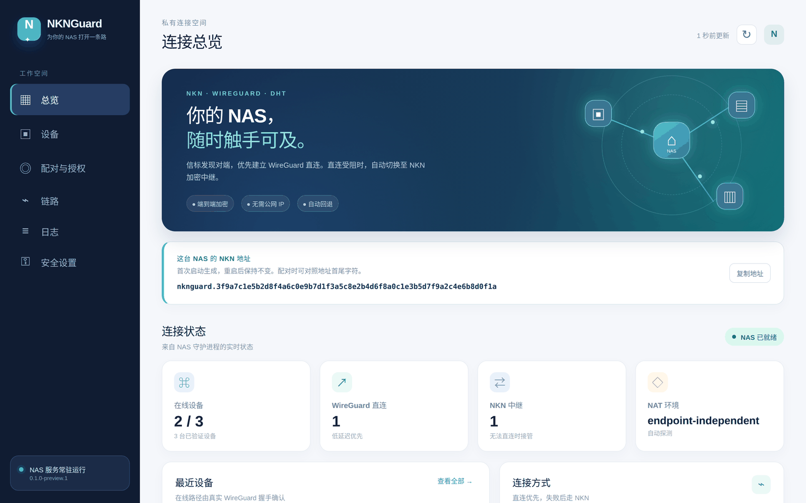

<div align="center">

# NKNGuard

**Reach your NAS from anywhere — no public IP, no relay server of ours.**

A WireGuard mesh coordinated over [NKN](https://nkn.org): direct whenever the NAT allows, an encrypted NKN relay when it does not.

[](https://github.com/Viper-Boss/nknguard/releases)
[](https://github.com/Viper-Boss/nknguard/actions/workflows/ci.yml)
[](https://github.com/Viper-Boss/nknguard/actions/workflows/android.yml)
[](LICENSE)


[简体中文](README.zh-CN.md) · **English**



</div>

> [!WARNING]
> **Development preview.** The protocol, NAS daemon, Windows and Android clients have automated tests, but real-network cross-NAT testing and on-device Android testing are not finished. Try it on non-critical devices first and do not rely on it as your only way in.

## Download

Everything is on the **[Releases page](https://github.com/Viper-Boss/nknguard/releases)**.

| Platform | File | Notes |
| --- | --- | --- |
| 🗄️ **NAS / Linux** (ARM64, incl. ARM fnOS) | `nknguard-linux-arm64` | Needs root and `wireguard-tools`; see [Install the NAS](#1-install-the-nas) |
| 🗄️ **NAS / Linux** (x86_64) | `nknguard-linux-amd64` | Same as above |
| 🪟 **Windows 10/11** | `NKNGuard-Windows-preview.zip` | Native desktop app with a tray icon; install [WireGuard for Windows](https://www.wireguard.com/install/) first |
| 🤖 **Android 8.0+** | `NKNGuard-Android-preview.apk` | Preview, not yet tested on real devices; uninstall the previous build before upgrading |

Each release ships a `SHA256SUMS` file: `sha256sum -c SHA256SUMS`. Preview builds are not code-signed.

## Screenshots

<table>
  <tr>
    <td width="50%"><br><sub><b>NAS dashboard · Pairing</b> — one-time QR plus the same pairing link as text, compare a six-digit code, approve; revoke single devices later</sub></td>
    <td width="50%"><br><sub><b>NAS dashboard · Overview</b> — device paths and NKNGuard users in the last 24 h / 30 d / 90 d</sub></td>
  </tr>
  <tr>
    <td width="50%"><br><sub><b>Windows client</b> — native window, one-click connect, keeps the tunnel in the tray</sub></td>
    <td width="50%"><br><sub><b>Windows client · First pairing</b> — paste the pairing link, confirm the same code on the NAS</sub></td>
  </tr>
</table>

<sub>Rendered from the real UI code with demo data (the Windows client under Wine). The UI is currently in Chinese. Android screenshots will follow on-device testing.</sub>

## Highlights

- 🔐 **WireGuard is the data plane.** All traffic is WireGuard-encrypted; NKNGuard never touches packet cryptography.
- 🛰️ **NKN is the control plane — no server of ours.** Devices find each other and exchange signed records over NKN; control messages are end-to-end encrypted.
- ⚡ **Direct first, relay second.** NAT is punched with WireGuard's own handshake. If that fails, **WireGuard ciphertext** rides an NKN session while the direct path keeps being retried, and traffic moves back as soon as it works.
- 📱 **Scan to pair, owner approves.** The QR holds only the NAS public key and a one-time request token — never the network secret. Every new device needs the six-digit code confirmed and approved on the NAS. Single devices can be revoked; a revoked phone gets a signed notice and disconnects at once.
- 🇨🇳 **Built-in China seed.** A mainland-China community NKN seed is tried before the overseas official seeds; add your own node in the config.
- 🧱 **The tunnel outlives the control plane.** If NKN drops, established WireGuard tunnels keep running.
- 📊 **Anonymous user counts.** The dashboard and clients show how many devices ran NKNGuard in the last 24 hours / 30 days / 90 days, read from zero-fee NKN on-chain subscriptions with no server involved. On by default and can be switched off; see [usage statistics](docs/USAGE_STATS.md) (Chinese).
- 🧭 **Overlay routes only.** Clients route just `10.88.0.0/16`; the default route and normal browsing are untouched.

## How it works

```text
Tailscale:  device ── coordination server ── device    (+ DERP relay)
NKNGuard:   device ── NKN signalling / DHT ── device   (+ NKN relay)
                            │
                            └─ data: WireGuard, direct whenever the NAT allows
```

| Path | When | Speed |
| --- | --- | --- |
| **WireGuard direct** | At least one side's NAT can be traversed (most home broadband) | Close to line rate |
| **NKN encrypted relay** | Both sides behind symmetric / carrier-grade NAT, or UDP blocked | Slow — a fallback so you are connected at all |

## Quick start

### 1. Install the NAS

**fnOS:** follow [docs/FNOS_DISK_DEPLOY.md](docs/FNOS_DISK_DEPLOY.md) to keep the binary, config and identity on a data disk.

**Other Linux:** amd64 or arm64, `wireguard-tools` (`wg`, `ip`), kernel WireGuard or `wireguard-go`, root, and a clock within ±2 minutes.

```bash
git clone https://github.com/Viper-Boss/nknguard && cd nknguard
mkdir -p bin && install -m 0755 ~/Downloads/nknguard-linux-arm64 bin/nknguard   # or build: make deps && make build
sudo ./scripts/install.sh
sudo nknguard init --name nas-home      # creates the network and asks for a dashboard password
sudo systemctl enable --now nknguard
```

### 2. Open the dashboard

The dashboard listens only on the NAS's `127.0.0.1:7878`. **Do not** publish it to the internet. From a computer on the LAN:

```bash
ssh -L 7878:127.0.0.1:7878 user@nas
# then open http://127.0.0.1:7878/ — user admin, the password set during init
```

Forgot it? Run `sudo nknguard dashboard-password set` on the NAS. Five wrong passwords in a row trigger a temporary back-off.

### 3. Pair a device

1. In **配对与授权 (Pairing)**, generate a QR code (valid 5 minutes); the same **pairing link** `nknguard://pair/v1?...` is shown under it with a copy button.
2. Request access from the device:
   - **Android** — open the app and tap “扫码配对” (scan to pair);
   - **Windows** — paste the pairing link into the client, enter a name, click “请求 NAS 配对”;
   - **Linux** — `sudo nknguard pair '<QR content>' --name laptop`.
3. Check that the **six-digit code** matches on both screens, then click **核对后批准** (approve) on the NAS.
4. Tap **Connect** on the device and reach the NAS on its virtual IP (shown in the client, e.g. `10.88.0.1`).

More: [Pairing](docs/PAIRING.md) · [Windows client](docs/WINDOWS.md) · [Android client](docs/ANDROID.md)

## Commands

| Command | |
| --- | --- |
| `nknguard init` | create a network and set the dashboard password |
| `nknguard pair <pairing-link>` | request owner-approved enrollment (Linux) |
| `nknguard dashboard-password set` | set or reset the dashboard password on the NAS |
| `sudo nknguard up` / `daemon` | run the node |
| `sudo nknguard down` | stop the node and remove the interface |
| `nknguard status` / `peers` | what is connected, how, and what happened |
| `nknguard reconnect <device-id>` | retry a direct path now |
| `nknguard doctor` | check the host, NAT and running node |
| `nknguard diagnostics export` | redacted bundle for a bug report |

```text
PEER      IP           PATH        STATE   ENDPOINT             LAST HANDSHAKE
laptop    10.88.41.7   direct-wg   DIRECT  203.0.113.5:51820    12s ago
vps-eu    10.88.3.200  nkn-relay   RELAY   127.0.0.1:41822      4s ago
```

## How peers find each other

| Source | Setup | Trade-off |
| --- | --- | --- |
| **NKN topic** (`nkn_topic: true`, default) | none | The topic name derives from the join secret; its subscriber list is public to anyone who knows it |
| **Private DHT** (`dht: true`, build tag `libp2pdht`) | bootstrap peers, or mDNS on a LAN | Project-private Kademlia, never the public IPFS DHT |
| **Static peers** (`static_peers:`) | list each other's NKN address | Nothing public at all |

Whatever the source, a tunnel is built only for a device whose signed record verifies, whose membership proof matches and which the NAS has approved.

**NKN seeds** are tried in order: `nkn.seed_rpc` from the config → the built-in China seed → the official seeds. To add a self-hosted node:

```yaml
nkn:
  seed_rpc:
    - http://192.168.1.10:30003
```

## Limitations

Stated plainly, because networking software that over-promises is worse than useless:

- **Not every NAT can be traversed.** Two peers both behind symmetric NAT will almost always be relayed. `nknguard doctor` tells you which case you are in.
- **The relay is slow.** It rides NKN sessions — a fallback, not a data plane.
- **Kernel WireGuard owns its UDP port**, so the public port is inferred assuming port-preserving NAT. True for most home routers, not all; see [NAT traversal](docs/NAT_TRAVERSAL.md).
- **Membership proofs still use a shared secret.** The NAS enforces an approved-device list and can revoke single devices; recreate network credentials if the secret or a device key leaks. Automated rotation is not implemented.
- **Preview clients.** IPv4 overlay, one network per node; no Android start-on-boot or always-on VPN yet.
- **Usage statistics are public.** When enabled, each device publishes an anonymous key on three public NKN topics once a day; the NKN node it talks to sees its IP address. Anyone can subscribe to the topics, so the counts are indicative.
- **Not anonymous.** WireGuard endpoints reveal IP addresses to peers, NKN addresses are linkable over time, and STUN servers see your public address.
- **The China seed is community-run** and may move; the official seeds remain as fallback.

## Documentation

[Architecture](docs/ARCHITECTURE.md) · [Protocol](docs/PROTOCOL.md) · [NAT traversal](docs/NAT_TRAVERSAL.md) · [Pairing](docs/PAIRING.md) · [Security model](docs/SECURITY.md) · [Build](docs/BUILD.md) · [Windows](docs/WINDOWS.md) · [Android](docs/ANDROID.md) · [fnOS deployment](docs/FNOS_DISK_DEPLOY.md) · [Usage statistics](docs/USAGE_STATS.md) · [Contributing](CONTRIBUTING.md) · [Reporting vulnerabilities](SECURITY.md)

## Build from source

```bash
go test ./...                                     # core, standard library only
make deps                                         # fetch nkn-sdk-go, libp2p
go build -tags "nknsdk libp2pdht" ./cmd/nknguard  # full binary
cd android && ./gradlew assembleDebug             # Android (JDK 17 + Android SDK, no NDK)
```

Requires Go ≥ 1.25.7. A binary built without `nknsdk` can `init`, `join` and `doctor`, and refuses `up` with an explanation. See [docs/BUILD.md](docs/BUILD.md).

## License

NKNGuard is licensed under **AGPL-3.0-only**; see [LICENSE](LICENSE). Notices for third-party modules are in [NOTICE](NOTICE).
