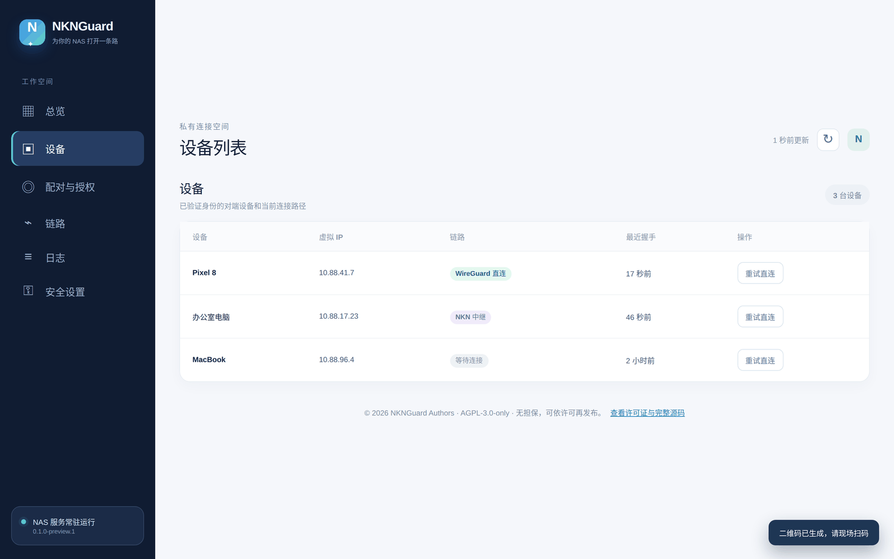

<div align="center">

# NKNGuard

**不需要公网 IP，也不需要中转服务器，随时连回你的 NAS。**

基于 [NKN](https://nkn.org) 的 WireGuard 组网：优先直连，打不通时自动走 NKN 加密中继。

[](https://github.com/Viper-Boss/nknguard/releases)
[](https://github.com/Viper-Boss/nknguard/actions/workflows/ci.yml)
[](https://github.com/Viper-Boss/nknguard/actions/workflows/android.yml)
[](LICENSE)


**简体中文** · [English](README.md)


</div>

> [!WARNING]
> **开发预览版。** 协议、NAS 端、Windows 与 Android 客户端都有自动化测试，但真实网络上的跨 NAT 测试、Android 真机测试还没有完成。请先在非关键设备上试用，不要把它当作唯一的远程访问手段。

## 下载

所有安装包都在 **[Releases 页面](https://github.com/Viper-Boss/nknguard/releases)**。

| 平台 | 文件 | 说明 |
| --- | --- | --- |
| 🗄️ **NAS / Linux**（ARM64，飞牛 ARM 机型） | `nknguard-linux-arm64` | 需要 root 与 `wireguard-tools`，见[安装 NAS 端](#1-安装-nas-端) |
| 🗄️ **NAS / Linux**（x86_64） | `nknguard-linux-amd64` | 同上 |
| 🪟 **Windows 10/11** | `NKNGuard-Windows-preview.zip` | 需要先安装 [WireGuard for Windows](https://www.wireguard.com/install/) 和 Microsoft Edge |
| 🤖 **Android 8.0+** | `NKNGuard-Android-preview.apk` | 预览版，尚未完成真机测试；升级前需先卸载旧版 |

每个版本都附带 `SHA256SUMS`，下载后可以核对：`sha256sum -c SHA256SUMS`。预览版没有代码签名。

## 截图

<table>
  <tr>
    <td width="50%"><br><sub><b>NAS 面板 · 配对与授权</b>：生成一次性二维码，核对六位验证码后批准，随时撤销单台设备</sub></td>
    <td width="50%"><br><sub><b>NAS 面板 · 设备</b>：每台设备当前走直连还是中继、最近一次真实握手时间</sub></td>
  </tr>
  <tr>
    <td width="50%"><br><sub><b>Windows 客户端</b>：一键连接，显示链路类型与双方 NKN 地址</sub></td>
    <td width="50%"><br><sub><b>Windows 客户端 · 首次配对</b>：粘贴配对内容，在 NAS 上核对同一个六位码</sub></td>
  </tr>
</table>

<sub>截图由真实界面代码渲染，设备名、地址等为演示数据。Android 截图将在真机测试完成后补充。</sub>

## 特点

- 🔐 **数据面是 WireGuard。** 所有流量都由 WireGuard 加密，NKNGuard 不碰包加密。
- 🛰️ **控制面是 NKN，没有我们的服务器。** 设备通过 NKN 网络互相发现、交换签名记录；控制消息端到端加密。
- ⚡ **先直连，后中继。** 用 WireGuard 自己的握手打洞；打不通时经 NKN 会话转发 **WireGuard 密文**，并在后台持续重试直连，成功后自动切回。
- 📱 **扫码配对，主人批准。** 二维码只含 NAS 公钥和一次性申请令牌，不含入网密钥。新设备必须在 NAS 面板核对六位码并批准；可以随时撤销单台设备，被撤销的手机会立即收到签名通知并断开。
- 🇨🇳 **内置国内 NKN 节点。** 国内网络优先使用国内社区 seed，连不上再回退官方节点；也可以在配置里加自建节点。
- 🧱 **隧道比控制面活得久。** NKN 暂时掉线时，已建立的 WireGuard 隧道照常工作。
- 📊 **匿名使用人数。** NAS 面板和客户端显示最近 24 小时 / 30 天 / 90 天的活跃设备数，数据来自 NKN 链上的零手续费订阅，不经过任何服务器；默认开启，可随时关闭，见 [使用人数统计](docs/USAGE_STATS.md)。
- 🧭 **只路由到覆盖网络。** 客户端只添加 `10.88.0.0/16` 路由，不改默认路由，普通上网不受影响。

## 工作原理

```text
Tailscale:  设备 ── 协调服务器 ─────── 设备      （+ DERP 中继）
NKNGuard:   设备 ── NKN 信令 / DHT ── 设备      （+ NKN 中继）
                          │
                          └─ 数据：WireGuard，NAT 允许时一律直连
```

| 路径 | 什么时候用 | 速度 |
| --- | --- | --- |
| **WireGuard 直连** | 至少一方的 NAT 能被打通（多数家庭宽带） | 接近带宽上限 |
| **NKN 加密中继** | 双方都在对称型 / 运营商级 NAT 后面，或 UDP 被限制 | 慢，只保证连得上 |

## 快速开始

### 1. 安装 NAS 端

**飞牛 fnOS：** 按 [docs/FNOS_DISK_DEPLOY.md](docs/FNOS_DISK_DEPLOY.md) 把程序、配置和身份都放在数据盘上。

**其他 Linux：** 需要 amd64 / arm64、`wireguard-tools`（`wg`、`ip`）、内核 WireGuard 或 `wireguard-go`、root，以及误差在 ±2 分钟内的系统时钟。

```bash
git clone https://github.com/Viper-Boss/nknguard && cd nknguard
mkdir -p bin && install -m 0755 ~/Downloads/nknguard-linux-arm64 bin/nknguard   # 或自己编译：make deps && make build
sudo ./scripts/install.sh
sudo nknguard init --name nas-home      # 创建网络，并设置管理面板密码
sudo systemctl enable --now nknguard
```

### 2. 打开管理面板

面板只监听 NAS 本机的 `127.0.0.1:7878`，**不要**把它映射到公网。从同一局域网的电脑访问：

```bash
ssh -L 7878:127.0.0.1:7878 用户名@NAS地址
# 然后在电脑浏览器打开 http://127.0.0.1:7878/ ，账号 admin，密码为 init 时设置的密码
```

忘记密码：在 NAS 上运行 `sudo nknguard dashboard-password set`。连续输错 5 次后会临时限速。

### 3. 配对设备

1. 在面板 **配对与授权** 中生成二维码（5 分钟有效）。
2. 在设备上发起申请：
   - **Android**：打开 App 点“扫码配对”；
   - **Windows**：复制二维码内容粘贴到客户端，填电脑名称，点“请求 NAS 配对”；
   - **Linux**：`sudo nknguard pair '<二维码内容>' --name laptop`。
3. 核对设备上和面板上显示的 **六位验证码** 一致，在面板点 **核对后批准**。
4. 在设备上点 **连接**，之后用 NAS 的虚拟 IP（默认 `10.88.0.1` 一类地址，界面里有显示）访问飞牛服务。

详细说明：[配对](docs/PAIRING.md) · [Windows 客户端](docs/WINDOWS.md) · [Android 客户端](docs/ANDROID.md)

## 常用命令

| 命令 | 作用 |
| --- | --- |
| `nknguard init` | 创建网络并设置面板密码 |
| `nknguard pair <配对内容>` | Linux 设备申请加入，需 NAS 批准 |
| `nknguard dashboard-password set` | 在 NAS 本机设置或重设面板密码 |
| `sudo nknguard up` / `daemon` | 前台运行节点 |
| `sudo nknguard down` | 停止节点并删除接口 |
| `nknguard status` / `peers` | 查看连接了谁、走什么路径 |
| `nknguard reconnect <设备 ID>` | 立即重试直连 |
| `nknguard doctor` | 检查本机环境、NAT 类型和运行状态 |
| `nknguard diagnostics export` | 导出已脱敏的诊断包，用于报告问题 |

```text
PEER      IP           PATH        STATE   ENDPOINT             LAST HANDSHAKE
laptop    10.88.41.7   direct-wg   DIRECT  203.0.113.5:51820    12s ago
vps-eu    10.88.3.200  nkn-relay   RELAY   127.0.0.1:41822      4s ago
```

## 节点如何互相发现

| 方式 | 配置 | 代价 |
| --- | --- | --- |
| **NKN 主题**（默认开启） | 无需配置 | 主题名由入网密钥派生；订阅者列表公开，知道主题名的人能看到有哪些 NKN 地址 |
| **私有 DHT**（`libp2pdht` 构建标签） | 引导节点，或局域网 mDNS | 项目私有 Kademlia，绝不加入公共 IPFS DHT |
| **静态对端**（`static_peers`） | 互相填写对方 NKN 地址 | 完全不公开任何信息 |

无论来源如何，只有签名有效、入网证明匹配、且在 NAS 批准名单中的设备才能建立隧道。

**NKN seed 节点**按“配置文件 `nkn.seed_rpc` → 内置国内节点 → 官方节点”的顺序依次尝试。自建 NKN 节点可以这样加：

```yaml
nkn:
  seed_rpc:
    - http://192.168.1.10:30003
```

## 局限（如实说明）

- **不是所有 NAT 都能穿透。** 双方都在对称型 NAT 后面时几乎一定走中继。`nknguard doctor` 会告诉你属于哪种情况。
- **中继很慢。** 走 NKN 会话，吞吐远低于直连，只是兜底。
- **内核 WireGuard 独占 UDP 端口**，公网端口根据探测 socket 推断（假设 NAT 保持端口不变）。大多数家用路由器成立，部分不成立，见 [NAT 穿透](docs/NAT_TRAVERSAL.md)。
- **成员证明仍基于共享密钥。** NAS 按批准名单执行单设备撤销；若共享密钥或设备私钥泄露，需要重建网络凭证，自动轮换尚未实现。
- **客户端是预览版。** 仅 IPv4 覆盖网络、每个节点只能加入一个网络；Android 暂无开机自启和“始终开启的 VPN”。
- **使用人数统计是公开的。** 开启时每台设备每天在三个公开 NKN 主题上登记一个匿名公钥，提交时 NKN 节点能看到连接 IP；任何人都能向这些主题提交订阅，人数仅供参考。
- **不匿名。** WireGuard 端点会向对端暴露 IP，NKN 地址可被长期关联，STUN 服务器能看到你的公网地址。
- **国内 seed 是社区节点**，地址可能变化，失效时会自动回退官方节点。

## 文档

[架构](docs/ARCHITECTURE.md) · [协议](docs/PROTOCOL.md) · [NAT 穿透](docs/NAT_TRAVERSAL.md) · [配对](docs/PAIRING.md) · [安全模型](docs/SECURITY.md) · [构建](docs/BUILD.md) · [Windows](docs/WINDOWS.md) · [Android](docs/ANDROID.md) · [飞牛部署](docs/FNOS_DISK_DEPLOY.md) · [使用人数统计](docs/USAGE_STATS.md) · [贡献](CONTRIBUTING.md) · [报告漏洞](SECURITY.md)

## 从源码构建

```bash
go test ./...                                     # 核心，标准库即可
make deps                                         # 拉取 nkn-sdk-go、libp2p
go build -tags "nknsdk libp2pdht" ./cmd/nknguard  # 完整版
cd android && ./gradlew assembleDebug             # Android（JDK 17 + Android SDK，不需要 NDK）
```

需要 Go ≥ 1.25.7。不带 `nknsdk` 标签的程序可以 `init`、`join`、`doctor`，但拒绝 `up`。详见 [docs/BUILD.md](docs/BUILD.md)。

## 许可证

NKNGuard 采用 **AGPL-3.0-only** 许可证，见 [LICENSE](LICENSE)。所用第三方模块的许可声明见 [NOTICE](NOTICE)。
